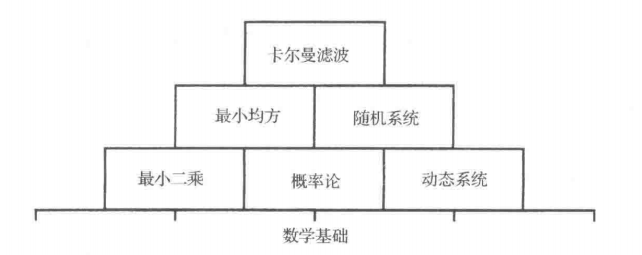
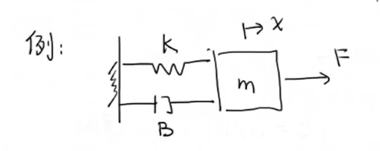
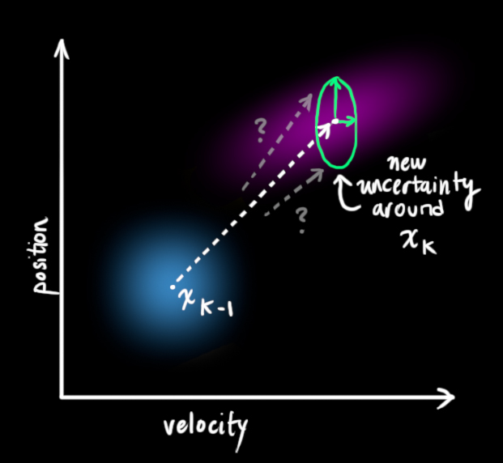
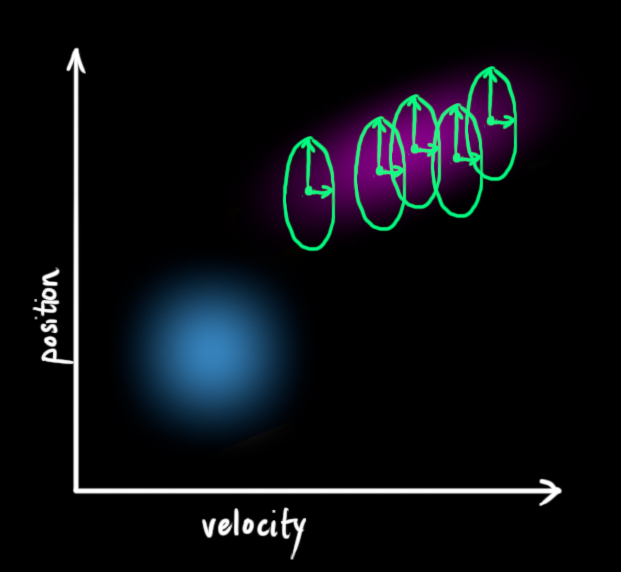
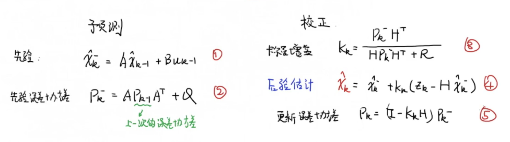

[TOC]

# 直观理解

> 误差可以 Allan 方差 估计算出

**首先卡尔曼滤波要解决的问题是什么**？我以机器人估计自己离障碍物距离为例

答：首先机器人已知“传感器测量的机器人离障碍物的距离（我们称它为**观测值，比如雷达直接测量机器人离障碍物距离7m**）”，“上个时刻机器人离障碍物距离”和“自己当前时刻的速度”这三个数据。而根据“上个时刻机器人离障碍物距离”和“自己当前时刻的速度”可以估算出当前机器人离障碍物的距离（我们称它为**估计值**）。

 **比如：上一秒离障碍物10m，速度是4m/s，那么现在这秒估计就离障碍物距离是6m**。（其实这个叫做机器人移动建模想了解更多移动模型与滤波算法的联系细节的童鞋可以看看《[机器人移动模型：根据控制命令预测机器人位置](https://link.zhihu.com/?target=https%3A//blog.csdn.net/varyshare/article/details/100061173)》这篇文章）

那么问题来了，**机器人离障碍物的距离现在既有个观测值7m，又有个估计值6m**。到底相信哪个？单纯相信观测值万一那传感器坏了呢？单纯相信估计值那么万一上个时刻的距离估计值或者速度不准呢？所以，我们要根据观测值和估计值的准确度来得到最终机器人离障碍物的距离估计值。准确度高的就最终结果比重高，准确度低就占比低。如果雷达测量的那个7m准确度是90%，根据速度估计出的那个6m准确度是80%，那么最终的距离估计结果就是 $\large \text { result }=\left(1-\frac{0.9}{0.8+0.9}\right) * 6+\frac{0.9}{0.8+0.9} * 7=6.52$ 米.

事实上 $\large \frac{0.9}{0.8+0.9}$ 这个就是所谓的卡尔曼增益，它就是表示这个传感器数据相对于根据速度计算出的估计值的靠谱程度。（每个传感器在使用前都可以对它的噪声的方差进行测量，可以搜下Allen方差，我们测量出每个传感器的噪声方差不就知道每个传感器靠谱程度了？)

# 状态空间表达

> 这部分是属于“现代控制理论”的内容

现在我们有一个弹簧阻尼系统：

$$
\large
\begin{aligned} 
m\ddot{x}+B\dot{x}+kx = F \longrightarrow (F:input)\\

\end{aligned}
$$
状态变量：
$$
\large
\begin{aligned} 
x_1 = x\\
x_2 = \dot{x}
\end{aligned}
$$
所以：
$$
\large
\begin{aligned} 
\dot{x_1} &= x_2\\
\dot{x_2} &= \ddot{x}\\
&= \frac{1}{m}u - \frac{B}{m}\dot{x}-\frac{k}{m}x \\
&= \frac{1}{m}u - \frac{B}{m}x_2-\frac{k}{m}x_1 \\
\\
\end{aligned}
\\
\large
\begin{aligned} 
Z_1 &= x = x-1 \longrightarrow 位置\\
Z_2 &= \dot{x} = x_2 \longrightarrow 速度
\end{aligned}
$$
把上述式子写成紧凑的矩阵形式的话
$$
\large
\begin{aligned} 
\begin{bmatrix}
 \dot{x_1}\\ 
 \dot{x_2}
\end{bmatrix} &= 
\begin{bmatrix}
 0&1\\ 
 -\frac{k}{m}&-\frac{B}{m}
\end{bmatrix}
\begin{bmatrix}
 {x_1}\\ 
 {x_2}
\end{bmatrix}+
\begin{bmatrix}
 0\\ 
 \frac{1}{m}
\end{bmatrix}u\\
\begin{bmatrix}
 z_1\\ 
z_2
\end{bmatrix} &= 
\begin{bmatrix}
1  & 0\\
0  & 1
\end{bmatrix}
\begin{bmatrix}
 x_1\\ 
 x_2
\end{bmatrix}
\end{aligned}\\
\LARGE
\Downarrow\\
\large
\begin{aligned} 
\dot{X_{(t)}} &=X_{(t)} + BU_{(t)}\\
Z_{(t)} &= HX_{(t)}
\end{aligned}
$$
现在上面就是一个**连续**的表达形式，把它写成离散的形式就是
$$
\large
\begin{aligned} 
X_k &= AX_{k-1} + BU_{k} {\color{Red} +  W_{k-1}} \\
Z_k &= HX_k  {\color{Red} + V_k} 
\end{aligned}
$$
下标 $k,k-1,k+1$ 是时间单位

- $W_{k-1}$ 是**过程噪声**
- $V_k$ 是**测量噪声** 

# 数据融合

首先，我们有两组数据 （ $\large z$ 是相当于期望，$\large \sigma$ 相当于方差）：
$$
\large
z_1 = 30g, \sigma_1 = 2g \\
\large
z_2 = 32g, \sigma_2 = 4g
$$
现在我们要求一个 **最优估计** $\large \hat{z}$ ：
$$
\large
\begin{aligned}     
\hat{z} &= kz_2 + (1-k)z_1\\
&= {\color{red}{z_1 +k(z_2-z_1)}}\\
\\
\sigma{^2}{_\hat{z}} &= Var(z_1+k(z_2-z_1))\\
&= Var(z_1-kz_1+kz_2)\\
&= Var((1-k)z_1 + kz_2)\\
\end{aligned}
$$

其中 $\large  (1-k)z_1$ 和 $\large kz_2$ 相互独立

$$
\large
\begin{aligned} 
\therefore \sigma{^2}{_\hat{z}} &= Var((1-k)z_1) + Var(kz_2)\\
&= (1-k)^2 Var(z_1) + k^2 Var(z_2)\\
\end{aligned}
$$

$$
\large
\begin{aligned} 
\because  Var(z_1) = \sigma{^2}{_1} 、Var(z_2) = \sigma{^2}{_2}\\
= (1-k)^2\sigma{^2}{_1} + k^2\sigma{^2}{_2}
\end{aligned}
$$

然后对 $\large \sigma{^2}{_\hat{z}}$ 求导
$$
\large
\begin{aligned} 
\frac{\mathrm{d} \sigma{^2}{_\hat{z}}}{\mathrm{d} k} &= 0\\
-2(1-k)\sigma{^2}{_1} + 2k\sigma{^2}{_2} &= 0\\
-\sigma{^2}{_1} + k\sigma^2{_1} + k\sigma{^2}{_2} &= 0\\
k(\sigma{^2}{_1} + \sigma{^2}{_2}) &= \sigma{^2}{_1}\\
\\
\LARGE
\therefore k = \frac{\sigma{^2}{_1}}{\sigma{^2}{_1} + \sigma{^2}{_2}}
\end{aligned}
$$
**这个 $k$ 就是 “卡尔曼增益”**
$$
\LARGE
k = \frac{\sigma{^2}{_1}}{\sigma{^2}{_1} + \sigma{^2}{_2}} = \frac{2^2}{2^2 + 4^2} = 0.2
$$
那么把 $\large k$ 带入 $\large {\color{red}{\hat{z} = z_1 +k(z_2-z_1)}}$  可以求出来， $\large \hat{z}$ 也就是**“最优估计”**是 30.4g 。 

## 高斯分布相乘

## 两个高斯分布相乘还是高斯分布

$$
\LARGE
\begin{aligned} 
f(x) = \frac{1}{\sqrt{2\pi}\sigma_1}e^{-\frac{(x-\mu_2)^2}{2\sigma{^2_1}}}，g(x) = \frac{1}{\sqrt{2\pi}\sigma_2}e^{-\frac{(x-\mu_2)^2}{2\sigma{^2_2}}}\\
\end{aligned}\\
\LARGE
\begin{aligned} 
h(x) &= f(x)\cdot g(x) \\
&= \frac{e^{-\frac{(\mu_1-\mu_2)^2}{2(\sigma_1^2+\sigma_2^2)}}}{\sqrt{2\pi(\sigma{^2_1}+\sigma{^2_2})}} \cdot \frac{1}{\sqrt{2\pi}\frac{\sigma_1\sigma_2}{\sqrt{\sigma{^2_1}+\sigma{^2_2}}}}e^{-\frac{(x-\frac{\mu_1 \sigma{^2_2}+\mu_2 \sigma{^2_1}}{\sigma_1^2+\sigma_2^2})^2}{2\frac{\sigma{^2_1}\sigma{^2_2}}{\sigma{^2_1}+\sigma{^2_2}}}}
\end{aligned}
$$

然后，我们令：
$$
\LARGE
\begin{aligned} 
A &= \frac{e^{-\frac{(\mu_1-\mu_2)^2}{2(\sigma_1^2+\sigma_2^2)}}}{\sqrt{2\pi(\sigma{^2_1}+\sigma{^2_2})}} （缩放因子）\\
\sigma_0 &= \frac{\sigma_1\sigma_2}{\sqrt{\sigma{^2_1}+\sigma^2_2}} （标准差）\\
\therefore \sigma_0^2 &= \frac{\sigma^2_1\sigma^2_2}{\sigma^2_1+\sigma^2_2} （方差）\\
\mu_0 &= \frac{\mu_1 \sigma^2_2}{\sigma_1^2+\sigma_2^2} （期望）\\

\end{aligned}
$$
所以 $h(x)$ 等于：
$$
\LARGE
\begin{aligned} 
h(x) &= A \cdot \frac{1}{\sqrt{2\pi}\sigma_0}e^{-\frac{(x-\mu_0)^2}{2\sigma^2_0}}\\
\end{aligned}
$$
 然后我们再改写一下 $\mu_0$ 和 $\sigma_0$ ：
$$
\LARGE
\begin{aligned} 
\sigma_0^2 &= \sigma_1^2 - \frac{\sigma^4_1}{\sigma^2_1+\sigma^2_2}\\
\mu_0 &= \mu_1 + \frac{\sigma^2_1}{\sigma^2_1+\sigma^2_2}(\mu_2-\mu_1)
\end{aligned}
$$

 因为 $\LARGE k = \frac{\sigma{^2}{_1}}{\sigma{^2}{_1} + \sigma{^2}{_2}}$ 也可以写成：
$$
\LARGE
\begin{aligned} 
\sigma_0^2 &= \sigma_1^2 - {\color{red}{k}}\sigma_1^2\\
\mu_0 &= \mu_1 + {\color{red}{k}}(\mu_2-\mu_1)
\end{aligned}
$$

再返回去看上面的例子，你会发现，其实是一样的， **记住这三个式子，后面也会用到** 

# 图解kalman

> [原版]:http://www.bzarg.com/p/how-a-kalman-filter-works-in-pictures/
> [翻译]:http://nutshellking.com/articles/xue-xi-zong-jie/Kalman_Filter/

## 我们能用卡尔曼滤波做什么？

让我们举个例子：你造了一个可以在树林里四处溜达的小机器人，为了让它实现导航，机器人需要知道自己所处的位置。

也就是说，机器人有一个包含位置信息和速度信息的状态 $\vec{x_k}$ ：
$$
\large
\vec{x_k} = (\vec{p}, \vec{v})
$$

注意，在这个例子中，状态是位置和速度，放进其他问题里，它也可以是水箱里的液体体积、汽车引擎温度、触摸板上指尖的位置，或者其他任何数据。

我们的小机器人装有GPS**传感器**，定位精度10米。虽然一般来说这点精度够用了，但我们希望它的定位误差能再小点，毕竟树林里到处都是土坑和陡坡，如果机器人稍稍偏了那么几米，它就有可能滚落山坡。所以GPS提供的信息还不够充分。

我们也可以**预测**机器人是怎么移动的：它会把指令发送给控制轮子的马达，如果这一刻它始终朝一个方向前进，没有遇到任何障碍物，那么下一刻它可能会继续坚持这个路线。但是机器人对自己的状态不是全知的：它可能会逆风行驶，轮子打滑，滚落颠簸地形……所以车轮转动次数并不能完全代表实际行驶距离，基于这个距离的预测也不完美。

这个问题下，**GPS**为我们提供了一些关于状态的信息，但那是间接的、不准确的；我们的**预测**提供了关于机器人轨迹的信息，但那也是间接的、不准确的。

但以上就是我们能够获得的全部信息，在它们的基础上，我们能得到一个比这两个估计值本身更好的答案吗？答案当然是肯定的，这就是我们接下来要讲到的卡尔曼滤波器。

## **卡尔曼滤波是如何看到你的问题的**

下面我们继续以只有位置和速度这两个状态的简单例子做解释。
$$
\large
\vec{x} = \begin{bmatrix}
p\\
v
\end{bmatrix}
$$
我们并不知道实际的位置和速度，它们之间有很多种可能正确的组合，但其中一些的可能性要大于其它部分

卡尔曼滤波假设这两个变量（在我们的例子中是位置和速度）是随机且符合[高斯分布](https://zh.wikipedia.org/wiki/正态分布)的，每一个变量有一个**平均值** $\large \mu$ ，以及**方差** $\large \sigma^2$  

- 如果位置和速度是**不相关**的，这意味着由其中一个变量的状态无法推测出另一个变量可能的值。
- 但如果位置和速度是**相关**的，观测特定位置的可能性取决于当前的速度：

这种情况是有可能发生的，例如，我们基于旧的位置来估计新位置。如果速度过高，我们可能已经移动很远了。如果缓慢移动，则距离不会很远。
　　这种相关性用**[协方差矩阵](https://en.wikipedia.org/wiki/Covariance_matrix)**来表示，简而言之，矩阵中的每个元素 $\large \Sigma_{ij}$ 表示第 i 个和第 j 个状态变量之间的相关度。（协方差矩阵是一个**[对称矩阵](https://en.wikipedia.org/wiki/Symmetric_matrix)**，这意味着可以任意交换 i 和 j)。协方差矩阵通常用 "$\large \mathbf {\Sigma}$" 来表示，其中的元素则表示为 "$\large  \Sigma_{ij}$" 。

## **使用矩阵来描述问题**

　　我们基于高斯分布来建立状态变量，所以在时刻 $k$ 需要两个信息：最佳估计 $\mathbf{\hat{x}_k}$ （即均值，其它地方常用 $\mu$ 表示)，以及协方差矩阵 $\mathbf{P_k}$ 。
$$
\large
\begin{equation} \label{eq:statevars} \begin{aligned}\mathbf{\hat{x}}_k &= 
\begin{bmatrix}
\text{position}\\
\text{velocity}
\end{bmatrix}\\
\mathbf{P}_k &=
\begin{bmatrix}
\Sigma_{pp} & \Sigma_{pv} \\
\Sigma_{vp} & \Sigma_{vv} \\
\end{bmatrix}
\end{aligned}
\end{equation}
$$
这里的 $\mathbf{P_k}$ 可以用这种方法来计算
$$
\large
\begin{equation} 
\mathbf{P_k} = E\begin{bmatrix}
\hat{x_k}&\hat{x^\mathrm{T}_k}
\end{bmatrix}
\end{equation}
$$
证明：
$$
\large
\begin{aligned} 

\mathbf{P_k} &= E\begin{bmatrix}
\begin{bmatrix}
P\\
v
\end{bmatrix}
\begin{bmatrix}
P&
v
\end{bmatrix}
\end{bmatrix}
\\
&=E\begin{bmatrix}
\begin{bmatrix}
P^2&pv\\
vp&v^2
\end{bmatrix}
\end{bmatrix}\\
&=
\begin{bmatrix}
E\begin{bmatrix}P^2\end{bmatrix}&E\begin{bmatrix}pv\end{bmatrix}\\
E\begin{bmatrix}vp\end{bmatrix}&E\begin{bmatrix}v^2\end{bmatrix}
\end{bmatrix}\\
&=
\begin{bmatrix}
E\begin{bmatrix}P^2\end{bmatrix}&E\begin{bmatrix}pv\end{bmatrix}\\
E\begin{bmatrix}vp\end{bmatrix}&E\begin{bmatrix}v^2\end{bmatrix}
\end{bmatrix}\\
\because &VAR(X) = E(x^2) - E(x)^2 \Longrightarrow  方差计算公式\\
\mathbf{P_k} &= 
\begin{bmatrix}
\sigma^2_p&\sigma^2_p\sigma^2_v\\
\sigma^2_v\sigma^2_p&\sigma^2_v
\end{bmatrix}\\
 &=
\begin{bmatrix}
\Sigma_{pp} & \Sigma_{pv} \\
\Sigma_{vp} & \Sigma_{vv} \\
\end{bmatrix}
\end{aligned}
$$

(此处我们仅使用了位置和速度两个变量，在实际应用中状态向量可包含任意个变量，用来表示你所关心的任何信息)。

接下来，我们很关心如何得到当前状态(**k-1**)和预测下一状态(**k**)，注意我们并不知道状态值是否真实，但是预测函数对此并不关心，它仅在所有状态可能性的基础上给出一个新的预测分布：

　　我们可以用矩阵 $F_k$ 来表示这个预测过程：

从上图可看出，每一个可能的向量 $X_{k-1}$ （原始估计）都可通过矩阵 $F_k$ 转换到 $X_{k}$ (预测值), 若原始估计值正确，则系统下一个时刻的状态很可能为预测值.

在我们这个机器人的小例子中，如何使用矩阵来预测下一时刻的位置和速度呢？使用基本的运动学公式：（这里认为两个时刻的速度近似不变）
$$
\large
\begin{split}
\color{deeppink}{p_k} &= \color{royalblue}{p_{k-1}} + \Delta t
&\color{royalblue}{v_{k-1}} \\
\color{deeppink}{v_k} &= &\color{royalblue}{v_{k-1}}
\end{split}
$$
既：
$$
\large
\begin{align} \color{deeppink}{\mathbf{\hat{x}}_k} &=
\begin{bmatrix}
1 & \Delta t \\
0 & 1
\end{bmatrix}
\color{royalblue}{\mathbf{\hat{x}}} \\ &= \mathbf{F}_k \color{royalblue}{\mathbf{\hat{x}}}\label{statevars} \end{align}
$$

现在我们得出了**预测矩阵** $F_k$ ，能告诉下一个状态；但如何更新协方差矩阵仍未知呢？

这里我们需要使用另外一个公式，如果对每一个具有概率分布的点乘以矩阵 $A$ ，其协方差矩阵 $\Sigma $ 会如何？
$$
\large
\begin{equation}
\begin{split}
Cov(x) &= \Sigma\\
Cov(\color{firebrick}{\mathbf{A}}x) &= \color{firebrick}{\mathbf{A}}\Sigma \color{firebrick}{\mathbf{A}}^T
\end{split} \label{covident}
\end{equation}
$$
　　结合上面两个式子可以得到：

$$
\large
\begin{equation}
\begin{split}
\color{deeppink}{\mathbf{\hat{x}}_k} &= \mathbf{F}_k\color{royalblue}{\mathbf{\hat{x}}_{k-1}} \\
\color{deeppink}{\mathbf{P}_k} &= \mathbf{F_k}\color{royalblue}{\mathbf{P}_{k-1}} \mathbf{F}_k^T
\end{split}　\label{eq5}
\end{equation}
$$

## **外部影响**

然而我们并未考虑完全，外部环境的某些变化可能**与状态向量不相关**，但仍能影响系统。
　　例如：若上节中的状态向量表示了列车的运动，列车驾驶员可能推动油门，使列车加速。类似的，在我们的机器人中，导航软件可能发出使轮子转动或停止的指令。如果知道实际情况中这些额外的信息，我们可以将其放在向量 $\color{darkorange}{\vec{\mathbf{u}_k}}$ 中，利用这个向量对我们的预测做进一步纠正.比

方说根据油门或控制指令，我们知道预期的加速度 $a$ ，可以得到：
$$
\large
\begin{split}
\color{deeppink}{p_k} &= \color{royalblue}{p_{k-1}} + {\Delta t}
&\color{royalblue}{v_{k-1}} + &\frac{1}{2} \color{darkorange}{a}
{\Delta t}^2 \\
\color{deeppink}{v_k} &= &\color{royalblue}{v_{k-1}} + &\color{darkorange}{a} {\Delta t}
\end{split}
$$
　　以矩阵的形式表示就是：

$$
\large
\begin{equation}
\begin{split}
\color{deeppink}{\mathbf{\hat{x}}_k} &= \mathbf{F}_k\color{royalblue}{\mathbf{\hat{x}}_{k-1}} + \begin{bmatrix}
\frac{\Delta t^2}{2} \\
\Delta t
\end{bmatrix} \color{darkorange}{a} \\
&= \mathbf{F}_k \color{royalblue}{\mathbf{\hat{x}}_{k-1}} +\mathbf{B}_k \color{darkorange}{\vec{\mathbf{u}_k}}
\end{split} \label{eq6}
\end{equation}
$$
 $\mathbf{B}_k$ 称之为**控制矩阵**， $\color{darkorange}{\vec{\mathbf{u}_k}}$ 为**控制向量**。（对于简单无外部干扰的系统，可忽略这两者）

我们可以加入更多细节，但若预测模型并非100%准确将会发生什么？

## **外部不确定性**

如果状态向量按照其固有属性发展，一切好说。如果系统在有外界力的作用下发展，只要我们知道这些力，仍没问题。

但如果我们不知道这些力，怎么办？例如，强风的影响，轮子打滑，路面颠簸. 我们无法对这些全部考虑，而这些事情会导致我们的预测失灵。

通过给每一步预测添加表示不确定的量，我们可以给环境的这种不确定性建模：

如上图所示，k-1时刻的估计值 $\color{royalblue}{\mathbf{\hat{x}}_{k-1}}$ 经过预测步骤后，可能以协方差 $\color{mediumaquamarine}{\mathbf{Q}_k}$ 移动至紫色高斯分布（Gaussian blob）内某个位置，也可以说将未知的环境影响视为协方差为 $\color{mediumaquamarine}{\mathbf{Q}_k}$ 的**噪音**。

这将产生一个新的高斯分布，但有不同的协方差（相同的平均值）：

我们通过简单地添加 $\color{mediumaquamarine}{\mathbf{Q}_k}$ 得到扩展的协方差，下面给出预测步骤的完整表达式：
$$
\large
\begin{equation}
\begin{split}
\color{deeppink}{\mathbf{\hat{x}}_k} &= \mathbf{F}_k\color{royalblue}{\mathbf{\hat{x}}_{k-1}} + \mathbf{B}_k\color{darkorange}{\vec{\mathbf{u}_k}} \\
\color{deeppink}{\mathbf{P}_k} &= \mathbf{F_k}\color{royalblue}{\mathbf{P}_{k-1}} \mathbf{F}_k^T +\color{mediumaquamarine}{\mathbf{Q}_k}
\end{split}
\label{kalpredictfull}
\end{equation}
$$
也就是说：

- ==新的最佳估计==是对==上一步最佳估计==的**预测**，并加上考虑已知的==外界影响==后的**修正量**
- ==新的不确定性==是从==上一步的不确定性==**预测**得来，并加上==环境的额外不确定性==

> In other words, the **new best estimate** is a **prediction** made from **previous best estimate**, plus a **correction** for **known external influences**.
>
> And the **new uncertainty** is **predicted** from the **old uncertainty**, with some **additional uncertainty from the environment**.

上面两个式子分别就是卡尔曼中的：

- **“计算先验估计(1)”**
- **“计算先验估计协方差(2)”**

## **用测量值来修正估计值**

我们可能有一些能给出系统状态信息的传感器. 目前它们能测什么没什么关系，可能有的传感器能测位置，有的能测速度. 每个传感器能**间接地（indirect）**给出状态的某些信息，也就是说，传感器对系统状态进行某种操作，从而给出**读数**。

注意到传感器读数的**单位和比例**与我们所关心的系统状态的单位和比例可能不同，你可能猜得到，我们以矩阵 $\mathbf{H}_k$ 给传感器这种行为建模。

我们可以弄明白传感器读数的分布， $\mathbf{H}_k$ 就是单位转换矩阵
$$
\large
\begin{equation}
\begin{aligned}
\vec{\mu}_{\text{观测}} &= \mathbf{H}_k\color{deeppink}{\mathbf{\hat{x}}_k} \\
\mathbf{\Sigma}_{\text{观测}} &= \mathbf{H}_k\color{deeppink}{\mathbf{P}_k} \mathbf{H}_k^T
\end{aligned}
\end{equation}
$$
我们将此不确定性(例如传感器噪音)的**协方差**称为 $\color{mediumaquamarine}{\mathbf{R}_k}$ ，此分布的**均值**就是我们观测到的读数 $\color{yellowgreen}{\vec{\mathbf{z}_k}}$ 。

现在我们有两个高斯分布，一个的中心是预测的转换 $\mathbf{H}_k\color{deeppink}{\mathbf{\hat{x}}_k}$ 后的均值，另一个的中心是传感器读数 $\color{yellowgreen}{\vec{\mathbf{z}_k}}$ 。

上面的这个式子就和“状态空间表达”的式子非常显示
$$
\large
\begin{aligned} 
\hat{x_k} &= A\hat{X_{k-1}} + BU_{k} {\color{Red} +  W_{k-1}} \\
Z_k &= H\hat{x_{kmea}}  {\color{Red} + V_k} 
\end{aligned}
\\
\large
\hat{x_k}是算出来的值\\
\large
\hat{x_{kmea}}是测出来的值
$$

- 这里的思路是把 $Z_k$ 测量的值乘上 $H^-$ 也就是：测量值 $\hat{x_{测量}} = H^-Z_k$ 
- 而上面的思路是把观测的值 $\hat{x_k}$  乘上 $H$ ，也就是：观测值 $\hat{x_{观测}}=H\hat{x_k}$   

本质上都是把**观测值**和**测量值**的单位转化为一致

## 结合高斯分布

在 **“数据融合”** 里面我们已经知道了
$$
\large
\begin{equation} \label{gainformula}
\color{purple}{\mathbf{k}} = \frac{\sigma_1^2}{\sigma_1^2 +\sigma_2^2}
\end{equation}
$$

$$
\large
\begin{equation}
\begin{split}
\color{royalblue}{\mu’} &= \mu_1 + &\color{purple}{\mathbf{k}}
(\mu_2 – \mu_1)\\
\color{mediumblue}{\sigma’}^2 &= \sigma_1^2 –
&\color{purple}{\mathbf{k}} \sigma_1^2
\end{split} \label{update}
\end{equation}
$$

再把上述公式写成矩阵版本。若 $\large \sigma$ 为高斯分布的协方差矩阵， $\large \vec{\mu}$ 为其均值，则有：
$$
\large
\begin{equation} \label{matrixgain}
\color{purple}{\mathbf{K}} = \Sigma_1 (\Sigma_1 +\Sigma_2)^{-1}
\end{equation}
$$

$$
\large
\begin{equation}
\begin{split}
\color{royalblue}{\vec{\mu}’} &= \vec{\mu_1} +
&\color{purple}{\mathbf{K}} (\vec{\mu_2} – \vec{\mu_1})\\
\color{mediumblue}{\Sigma’} &= \Sigma_1 –
&\color{purple}{\mathbf{K}} \Sigma_1
\end{split} \label{matrixupdate}
\end{equation}
$$

将 $\large \color{purple}{\mathbf{K}}$ 矩阵称为**卡尔曼增益**

## 综上所述

我们有两个分布：

- 预测值的测量 $\large (\color{fuchsia}{\mu_1},\color{deeppink}{\Sigma_1}) = (\color{fuchsia}{\mathbf{H}_k\mathbf{\hat{x}}_k}, \color{deeppink}{\mathbf{H}_k \mathbf{P}_k\mathbf{H}_k^T})$ 
- 观测到的测量 $\large (\color{yellowgreen}{\mu_2},\color{mediumaquamarine}{\Sigma_2}) = (\color{yellowgreen}{\vec{\mathbf{z}_k}},\color{mediumaquamarine}{\mathbf{R}_k})$ 

将他们代入上面的式子中：
$$
\large
\begin{equation}
\begin{aligned}
\mathbf{H}_k \color{royalblue}{\mathbf{\hat{x}}_k’} &=\color{fuchsia}{\mathbf{H}_k \mathbf{\hat{x}}_k} & + &\color{purple}{\mathbf{K}} (\color{yellowgreen}{\vec{\mathbf{z}_k}} –\color{fuchsia}{\mathbf{H}_k \mathbf{\hat{x}}_k} ) \\
\mathbf{H}_k \color{royalblue}{\mathbf{P}_k’} \mathbf{H}_k^T &=\color{deeppink}{\mathbf{H}_k \mathbf{P}_k \mathbf{H}_k^T} & – &\color{purple}{\mathbf{K}} \color{deeppink}{\mathbf{H}_k\mathbf{P}_k \mathbf{H}_k^T}
\end{aligned} \label {kalunsimplified}
\end{equation}
$$

$$
\large
\begin{equation} \label{eq:kalgainunsimplified}
\color{purple}{\mathbf{K}} = \color{deeppink}{\mathbf{H}_k\mathbf{P}_k \mathbf{H}_k^T} ( \color{deeppink}{\mathbf{H}_k\mathbf{P}_k \mathbf{H}_k^T} +\color{mediumaquamarine}{\mathbf{R}_k})^{-1}
\end{equation}
$$

再把上面的式子化简一下，去掉 $\large \mathbf{H}_k,\mathbf{H}_k^T$ ：
$$
\LARGE
\begin{equation}
\begin{split}
\color{royalblue}{\mathbf{\hat{x}}_k’} &=\color{fuchsia}{\mathbf{\hat{x}}_k} & + &\color{purple}{\mathbf{K}’} (\color{yellowgreen}{\vec{\mathbf{z}_k}} –\color{fuchsia}{\mathbf{H}_k \mathbf{\hat{x}}_k} ) \\
\color{royalblue}{\mathbf{P}_k’} &= \color{deeppink}{\mathbf{P}_k}
& – & \color{purple}{\mathbf{K}’} \color{deeppink}{\mathbf{H}_k\mathbf{P}_k}
\end{split}
\label{kalupdatefull}
\end{equation}
$$

$$
\LARGE
\begin{equation}
\color{purple}{\mathbf{K}’} = \color{deeppink}{\mathbf{P}_k\mathbf{H}_k^T} ( \color{deeppink}{\mathbf{H}_k \mathbf{P}_k\mathbf{H}_k^T} + \color{mediumaquamarine}{\mathbf{R}_k})^{-1}
\label{kalgainfull}
\end{equation}
$$

上面的三个式子分别就是卡尔曼公式中的 

- **“计算后验估计(4)” **
- **“更新误差协方差(5)”**
- **"计算更新卡尔曼增益(3)" **

